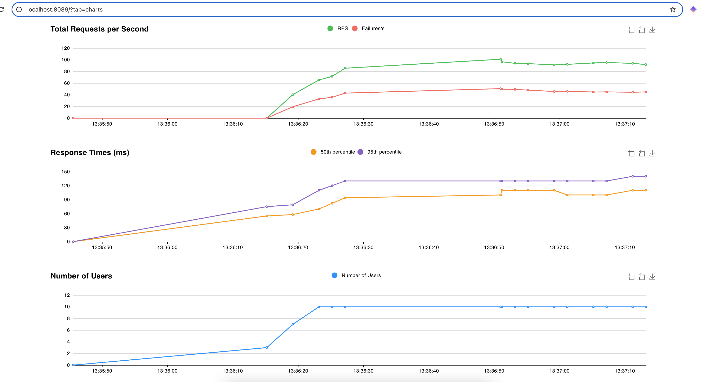

### Test Suite for app

***Installting locust***

```bash
pip install locust
pip install Faker
```

***Running test cases***

```bash
[2024-12-19 13:35:39,402] Nischays-MacBook-Pro/INFO/locust.main: Starting Locust 2.32.4
[2024-12-19 13:35:39,403] Nischays-MacBook-Pro/INFO/locust.main: Starting web interface at http://0.0.0.0:8089
[2024-12-19 13:36:13,158] Nischays-MacBook-Pro/INFO/locust.runners: Ramping to 10 users at a rate of 1.00 per second
[2024-12-19 13:36:22,171] Nischays-MacBook-Pro/INFO/locust.runners: All users spawned: {"GetHealthCheck": 10} (10 total users)
KeyboardInterrupt
2024-12-19T08:07:57Z
[2024-12-19 13:37:57,645] Nischays-MacBook-Pro/INFO/locust.main: Shutting down (exit code 1)
| Type     Name                                                                          # reqs      # fails  | Avg     Min     Max    Med                                                   | req/s  failures/s |
| ----------------------------------------------------------------------------------------------------------- | ---------------------------------------------------------------------------- | ----------------- | ------------- | ------- | ------- | ------- | ------- | -------- | ----------- |
| GET      /health                                                                         2726     0(0.00%)  | 98      13     246     99                                                    | 45.41        0.00 |
| POST     /new_task                                                                       2720 2720(100.00%) | 105      54     251    110                                                   | 45.31       45.31 |
| --------                                                                                                    | ---------------------------------------------------------------------------- | -------           | ------------- | ------- | ------- | ------- | ------- | -------- | ----------- |
| Aggregated                                                                      5446 2720(49.94%)           | 101      13     251    100                                                   | 90.72       45.31 |

Response time percentiles (approximated)
Type     Name                                                                                  50%    66%    75%    80%    90%    95%    98%    99%  99.9% 99.99%   100% # reqs
--------|--------------------------------------------------------------------------------|--------|------|------|------|------|------|------|------|------|------|------|------
GET      /health                                                                                99    110    110    110    120    130    140    150    240    250    250   2726
POST     /new_task                                                                             110    110    120    120    130    130    140    160    240    250    250   2720
--------|--------------------------------------------------------------------------------|--------|------|------|------|------|------|------|------|------|------|------|------
         Aggregated                                                                            100    110    110    120    120    130    140    160    240    250    250   5446

Error report
# occurrences      Error                                                                                               
------------------|---------------------------------------------------------------------------------------------------------------------------------------------
2357               POST /new_task: Failed: {"task_added":true}                                                         
363                POST /new_task: Failed: {"task_added":false,"error":400}                                            
------------------|---------------------------------------------------------------------------------------------------------------------------------------------

```

***Test Results***




##### Links
1. https://docs.locust.io/en/stable/quickstart.html
2. https://faker.readthedocs.io/en/master/index.html